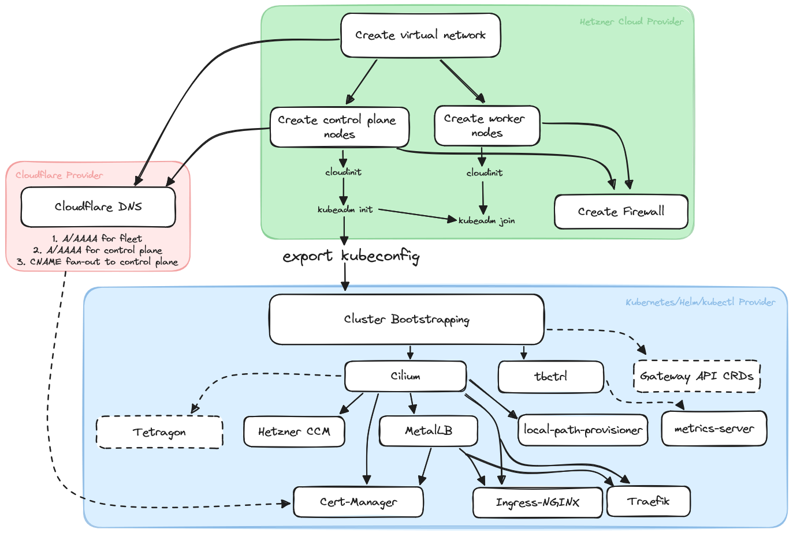

# Terraform + Hetzner Cloud + Kubernetes (kubeadm)

This repository stores both modules and should be used as a template for *your*
infrastructure. Most of this is inherently private, so publishing *your*
infrastructure state by forking this repository is *not the best idea!*

You can mix and match modules as you see fit, but be advised that the template
does not "fit all needs". It was created for a specific intent, i.e., deploying
Hetzner Cloud machines with Ubuntu 22.04, kubeadm alongside the requirements to
deploy a very oppinionated tech stack onto Kubernetes, namely Cilium as CNI,
Rancher's local-path-provisioner for dynamic PV provisioning using *the node's
storage* instead of relying on CSI compatible providers like Longhorn or other
vendor-specific storage solutions, alongside some fairly common cert-manager +
cluster issuer configuration, Metallb for LB services using the nodes' IP pool,
and some other stuff, explained in more detail below. If this does not fit your
goal, make your adoptions accordingly.

## Prerequisites

This module requires some stuff you need to provide authentication-wise.

1. First and foremost, you will need a Hetzner Cloud API token, which can be
   created through the dashboard or the hcloud CLI.
2. You'll also need your SSH keys to be placed automatically on the created
   nodes. This can either be a key pair of your system's user, or freshly
   created ones for these machines (which, from a security point is more
   desirable).
3. We use Cloudflare for most of our DNS, and the public-facing nodes are
   receive their own DNS records, firstly for convenience in management and also
   because we route traffic to the cluster via the host network interfaces using
   Metallb. While we can map the IPs directly in A/AAAA records, it is
   oftentimes more convenient for opting for a deferred model, where DNS for
   services deployed on the cluster points to the host's DNS records using CNAME
   RRs. This also immediately reduces hardcoded IPs. If you want to use this
   too, you'll have to obtain an API token for your zone in Cloudflare.
4. For cert-manager, we create two sets of ACME ClusterIssuers, one using Let's
   Encrypt (easy to setup, just requires an email address), and (amidst the
   recent Cloudflare outage [see
   <https://groups.google.com/a/chromium.org/g/ct-policy/c/VegqtnnrO3Q>], where
   Let's Encrypt certificates using the Cloudflare CT log could potentially be
   removed from trust stores, thus being considered "not secure" anymore) Google
   Trust Services, which requires a GCP account, from which you need to create
   *external account binding (EAB)* credentials (see
   <https://cloud.google.com/certificate-manager/docs/public-ca-tutorial> for a
   tutorial).

Strictly speaking, only (1) and (2) are required, in particular obtaining the
Google Trust Services credentials can be tedious and are not strictly relevant.
If you want it, enable it using the corresponding variables. Note that the
ClusterIssuers created here implicitly rely on Cloudflare DNS being used: The
DNS01 issuers use Cloudflare for DNS lookup for the domains to sign the
certificate for. Thus, enabling either of the ClusterIssuer resources, GTS or
Let's Encrypt requires Cloudflare DNS to be enabled.

Terraform and infrastructure provisioning work quite nicely out of the box,
given the hcloud provider is of solid quality. However, afterwards, things get a
bit more tricky.

Terraform isn't particularly well-suited for bootstrapping, configuring nodes,
running scripts on the nodes, copying files between the provisioner and the
remote nodes, or even inbetween nodes. That being said, errors when running
`terraform apply` (or these days, also `tofu apply`), are mostly occurring with
deploying stuff onto Kubernetes. The entire provisioning and even the creation
of the cluster works fairly smoothly and is considered stable enough for
practical use. Errors during the creation relating to e.g. timeouts
communicating with the Kubernetes API server are mostly related to the local
kubeconfig not being created yet, or some other time-based race conditions. They
can be resolved by simply running `terraform apply` (or `tofu apply`
respectively) again.

## Included Batteries

The module is composed of several local submodules:

- *network* creates a virtual private IPv4 network
- *nodes* creates VMs on Hetzner Cloud and networks them together using the
  outputs of *network*. It also runs cloudinit scripts on all nodes to install
  the required software
- *firewall* creates a Cloud firewall for the nodes
- *kubeconfig* exports the kubeconfig file from a control plane node such that
  subsequent Kubernetes providers can interact with the created cluster.
- *dns* configures Node DNS for the fleet and the cluster on Cloudflare DNS.
- *cluster* contains all resources to be deployed onto Kubernetes *after the
  cluster is created*

Apart from that, `control-plane.tf` and `workers.tf` contain the steps performed
on each group of nodes that either runs `kubeadm init` or `kubeadm join`.

The components included in the *cluster* module are:

- Cilium as CNI __(required)__
- Hetzner Cloud Controller Manager for configuring Nodes and routes in the VPN
- MetalLB for LoadBalancer service implementation using L2 announcements
- Rancher local-path-provisioner for dynamically provisioning PVs from the nodes' storage
- cert-manager + ClusterIssuers for Let's Encrypt and Google Trust Services
- Kubernetes metrics-server and a controller for automatically administering
  Kubelet signing certificates (<https://github.com/zoomoid/tbctrl>).
- Gateway API CRDs
- ingress-nginx or traefik ingress controller
- cilium's Tetragon

Except for Cilium, all of these are optional. The below figure depicts the loose dependency graph



## Getting Started

The entrypoint for configuration is creating a file providing all the top-level
variables. The common practice for this is creating a `.tfvars` file containing
all the definitions

```terraform
# secrets.tfvars

hcloud_api_token = "<your hetzner cloud api token>"

ssh_user             = "root" # required for at least the cloudinit scripts, likely also for running kubeadm
ssh_private_key_path = "..."
ssh_public_key_path  = "..."
```

### Nodes Section

Configure node pools and cloudinit parameters. We also require *a single control plane node* to be defined as the leader of a possible HA control plane. Only one node must run `kubeadm init` (defined as `primary_control_plane_node`), while all others run some form
of `kubeadm join` either for workers or for additional control plane nodes.

```terraform
# secrets.tfvars

control_plane_nodes = {
  # map of all control plane nodes by their name with parameters for hcloud instances
  "control-plane" = {
    server_type = "cax21",
    image = "ubuntu-22.04",
    location = "fsn1",
    datacenter = "fsn1-dc14"
  }
  ...
}

worker_nodes = {
  "worker-1" = {
    server_type = "cax11",
    image = "ubuntu-22.04",
    location = "fsn1",
    datacenter = "fsn1-dc14"
  },
  "worker-2" = {
    ...
  }
}

primary_control_plane_node = "control-plane"

# cloudinit: 
# define all the URLs and other parameters required for cloudinit to install the relevant things on each node
# The below examples install Linux 6.2, containerd v1.7.3, runc v1.1.8, cni-plugins v1.3.0, nerdctl (for container maintenance) v1.5.0,
# and Kubernetes 1.28. Adjust them as you see fit
cloudinit_linux_kernel_package           = "linux-image-6.2.0-32-generic"
cloudinit_containerd_url                 = "https://github.com/containerd/containerd/releases/download/v1.7.3/containerd-1.7.3-linux-arm64.tar.gz"
cloudinit_containerd_systemd_service_url = "https://raw.githubusercontent.com/containerd/containerd/main/containerd.service"
cloudinit_runc_url                       = "https://github.com/opencontainers/runc/releases/download/v1.1.8/runc.arm64"
cloudinit_cni_plugins_url                = "https://github.com/containernetworking/plugins/releases/download/v1.3.0/cni-plugins-linux-arm64-v1.3.0.tgz"
cloudinit_nerdctl_url                    = "https://github.com/containerd/nerdctl/releases/download/v1.5.0/nerdctl-full-1.5.0-linux-arm64.tar.gz"
cloudinit_kubernetes_apt_keyring         = "https://pkgs.k8s.io/core:/stable:/v1.28/deb"
cloudinit_kubernetes_version             = "1.28.0"
```

### DNS Section

This section is for DNS RR creation and also for the cert-manager cluster
issuers (see below).

> Note that including any of the cert-manager issuers requires this section to be enabled.

```terraform
# secrets.tfvars

enable_cloudflare_dns = true

cloudflare_api_key = "<your cloudflare api token>
# used for cert-manager issuers, not directly for the records
cloudflare_email   = "<your cloudflare username/email>"
cloudflare_zone_id = "<your cloudflare zone id>"

# your cluster's root domain; may not be a proper DNS root, can include subdomains
dns_root              = "example.com"
dns_cluster_subdomain = "cluster"
dns_fleet_subdomain   = "fleet"
```

### Firewall Section

Configure the cloud firewall on Hetzner Cloud. The firewall is optional but
highly recommended. The below example includes some suggestions but depending on
what services you want to deploy, you might have to adapt it.

```terraform
# secrets.tfvars

enable_firewall = true
static_firewall_rules = [
  # Kubernetes Control Plane
  {
    direction = "in"
    protocol  = "tcp"
    port      = "6443"
    source_ips = [
      "0.0.0.0/0",
      "::/0"
    ]
  },
  # Allow all traffic to the ssh port
  {
    direction = "in"
    protocol  = "tcp"
    port      = "22"
    source_ips = [
      "0.0.0.0/0",
      "::/0"
    ]
  },
  # Allow ping on ipv4/ipv6
  {
    direction = "in"
    protocol  = "icmp"
    source_ips = [
      "0.0.0.0/0",
      "::/0"
    ]
  },
  # Allow HTTP(S) traffic on ipv4/ipv6
  {
    direction = "in"
    protocol  = "tcp"
    port      = "80"
    source_ips = [
      "0.0.0.0/0",
      "::/0"
    ]
  },
  {
    direction = "in"
    protocol  = "tcp"
    port      = "443"
    source_ips = [
      "0.0.0.0/0",
      "::/0"
    ]
  },
  # HTTP/3 via UDP
  {
    direction = "in"
    protocol  = "udp"
    port      = "443"
    source_ips = [
      "0.0.0.0/0",
      "::/0"
    ]
  },
  # Kubernetes Node Port services
  {
    direction = "in"
    protocol  = "tcp"
    port      = "30000-32767"
    source_ips = [
      "0.0.0.0/0",
      "::/0"
    ]
  },
  {
    direction = "in"
    protocol  = "udp"
    port      = "30000-32767"
    source_ips = [
      "0.0.0.0/0",
      "::/0"
    ]
  },
  # Cilium UDP encapsulation ports. If you deploy Cilium with native routing, 
  # you don't need this
  # (1) VXLAN
  {
    direction = "in",
    protocol  = "udp",
    port      = "8472",
    source_ips = [
      "0.0.0.0/0",
      "::/0"
    ],
  },
  # (2) Geneve
  {
    direction = "in",
    protocol  = "udp",
    port      = "6081",
    source_ips = [
      "0.0.0.0/0",
      "::/0"
    ],
  }
]
```

### Cluster Section

This configures most of the Kubernetes-related components, i.e., deployments and
helm releases. Most of this is optional, except for deploying Cilium as CNI. For
everything else, there are appropriate `enable_*` variables.

```terraform
# secrets.tfvars

cilium_values = <<-EOT
# Cilium helm values. This is highly dependent on what you need, 
# here are some pointers:
kubeProxyReplacement: true
# routingMode: native
tunnel: vxlan # or "geneve" or "none" for native routing
# Dual-Stack: Nodes don't share an L2 network, so this does not work 
# Cannot be used with tunnel != none
# autoDirectNodeRoutes: true
ipv4:
  enabled: true
ipv6:
  enabled: true
ipam:
  mode: kubernetes # or "cluster-pool"
k8s:
  requireIPv4PodCIDR: true
  requireIPv6PodCIDR: true
# ipv4NativeRoutingCIDR: 10.0.0.0/16
# ipv6NativeRoutingCIDR: fd00::/100 # also try ::/0
endpointRoutes:
  enabled: true
hostPort:
  enabled: true
nodePort:
  enabled: true
loadBalancer:
  # mode: hybrid
  # acceleration: native
  algorithm: maglev
hubble:
  relay:
    enabled: true
  ui:
    enabled: true
monitor:
  enabled: true
ingressController:
  enabled: false
  # loadbalancerMode: shared
encryption:
  enabled: false
  type: wireguard
  nodeEncryption: false
operator:
  replicas: 1
rolloutCiliumPods: true
# cannot be used in tunnel mode
bandwidthManager:
  enabled: false
  bbr: false
endpointStatus:
  enabled: true
  status: "health controller log state"
l2announcements:
  # clashes with MetalLB and LB service IP assignment. 
  # Also currently does not support IPv6
  enabled: false
# only really required when l2 announcements are on
k8sClientRateLimit:
  qps: 15
  burst: 20
EOT

enable_cert_manager            = true
enable_cert_manager_csi_driver = true

enable_tetragon = true

enable_gateway_api = false

enable_hetzner_cloud_controller_manager        = true
enable_hetzner_cloud_controller_manager_routes = false

enable_kubelet_tls_bootstrapping_controller = true
enable_metrics_server                       = true

enable_lets_encrypt_dns01  = true
enable_lets_encrypt_http01 = true
lets_encrypt_email         = "<your email for lets encrypt>"

enable_local_path_provisioner = true

enable_metallb       = true
enable_traefik       = true
enable_ingress_nginx = false

enable_google_trust_services_dns01  = true
enable_google_trust_services_http01 = true
google_cloud_platform_eab_kid       = "<GCP EAB key id>"
google_cloud_platform_eab_hmac_key  = "<GCP EAB HMAC key>"
```

Then, run `terraform plan -var-file="secrets.tfvars" -out ...`, or, if you feel
like it, run `terraform apply -var-file="secrets.tfvars"` directly.

## Decomissioning

Destroying everything is easily done with `terraform destroy
-var-file="secrets.tfvars"`. If you want to get rid of only certain (optional)
things, use the `enable_*` variables, which will cause Terraform to destroy only
the disabled parts.
